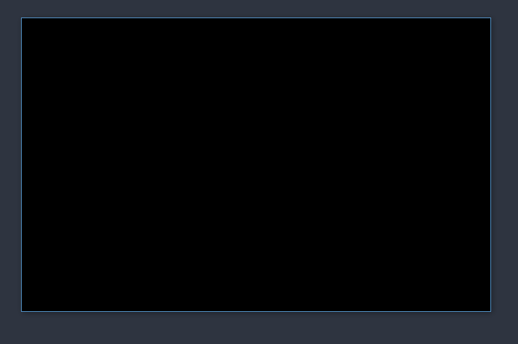

### create_screen
Prerequisites : [[setting-up-the-environment]]

#WholeCode

```python
import pygame
WINDOW_WIDTH = 800
WINDOW_HEIGHT = 500
window = pygame.display.set_mode((WINDOW_WIDTH, WINDOW_HEIGHT))
pygame.display.set_caption("Snake Game")
game_over = False
while not game_over:
    print()
pygame.quit()
quit()
```


### Break Down

1. Import The Module
```python
import pygame
```
2.  Define Game Window Properties
```python
WINDOW_WIDHT = 800
WINDOW_HEIGHT = 500
```
3. Define the Window
```python
window=pygame.display.set_mode((WINDOW_WIDHT,WINDOW_HEIGHT))

```

4. Keeping the window open
		The while loop helps to keep the window open


5. Update the display 

```python
pygame.display.update()
```
[Reference](https://devdocs.io/pygame/ref/display#pygame.display.update)
 
6. Uninitialize all variables and quit
```python
pygame.quit()
quit()
```

