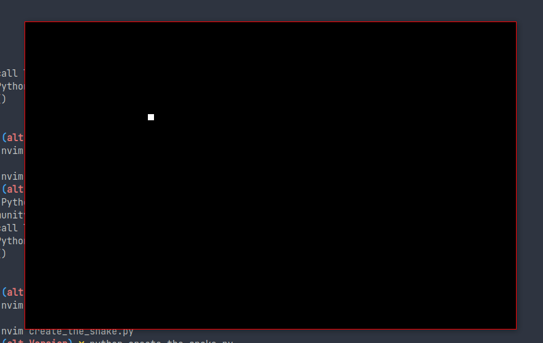

### create_the_snake
 Prerequisites : [[create_screen]]

#WholeCode

```python
import pygame

BLACK = (0, 0, 0)
WHITE = (255, 255, 255)

WINDOW_WIDTH = 800
WINDOW_HEIGHT = 500
window = pygame.display.set_mode((WINDOW_WIDTH, WINDOW_HEIGHT))
pygame.display.set_caption("Snake Game")
game_over = False
while not game_over:
    for event in pygame.event.get():
        if event.type == pygame.QUIT:
            game_over = True
    pygame.draw.rect(window, WHITE, [200, 150, 10, 10])
    pygame.display.update()
pygame.quit()
quit()

```
#### Preview



### BreakDown
```python
for event in pygame.event.get():
        if event.type == pygame.QUIT:
            game_over = True
    pygame.draw.rect(window, WHITE, [200, 150, 10, 10])
    pygame.display.update()
```
- `pygame.draw.rect()`Draws a rectangle in the specified window
    - The parameters passed to that methods are 
        1. Window name
        2. Color
        3. Position

<details>
    <summary>From Reference</summary>
    <i>draw a rectangle</i>
        rect(surface, color, rect) -> Rect
        rect(surface, color, rect, width=0, border_radius=0, border_top_left_radius=-1, border_top_right_radius=-1, border_bottom_left_radius=-1, border_bottom_right_radius=-1) -> Rect
    </details>
        [Reference](https://devdocs.io/pygame/ref/draw#pygame.draw.rect)


